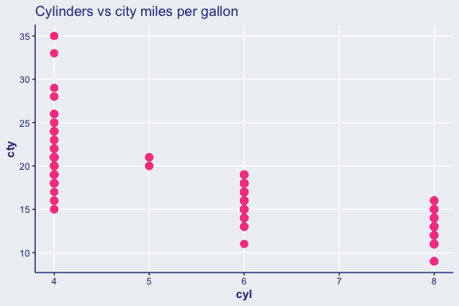
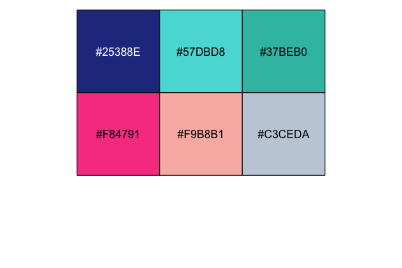
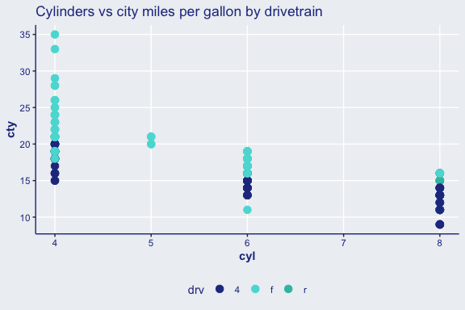
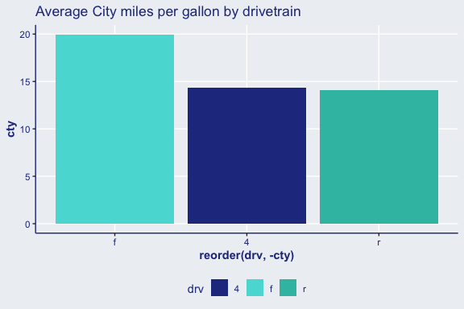

# ggorbisant

Colour palettes and plotting themes for Orbisant Analytics website

## Installation

You can install `ggorbisant` from GitHub by running the following:

``` r
devtools::install_github("hendersontrent/ggorbisant")
```

## Theme Orbisant

The theme works by adding the function call to the end of your `ggplot2`
code:

``` r
library(ggplot2)
library(ggorbisant)

ggplot(mpg, aes(x = cyl, y = cty)) +
  geom_point(size = 3) +
  labs(title = "Cylinders vs city miles per gallon") +
  theme_orbisant(grids = TRUE)
```

<!-- -->

The colour palette built into the package is presented below:

``` r
library(scales)

scales::show_col(ggorbisant:::orbisant_palette)
```

<!-- -->

## This palette can be used for colouring (and filling) plots

Use `scale_colour_orbisant()` to apply the theme for colour parameters.

``` r
ggplot(mpg, aes(x = cyl, y = cty, colour = drv)) +
geom_point(size = 3) +
labs(title = "Cylinders vs city miles per gallon by drivetrain") +
scale_colour_orbisant() +
theme_orbisant(grids = TRUE)
```

<!-- -->

And `scale_fill_orbisant()` to apply the theme for fill parameters.

``` r
library(dplyr)
library(magrittr)

mpg %>%
group_by(drv) %>%
summarise(cty = mean(cty)) %>%
ungroup()%>%
ggplot(aes(x = reorder(drv, -cty), y = cty, fill = drv)) +
geom_col() +
labs(title = "Average City miles per gallon by drivetrain") +
scale_fill_orbisant() +
theme_orbisant()
```

<!-- -->
